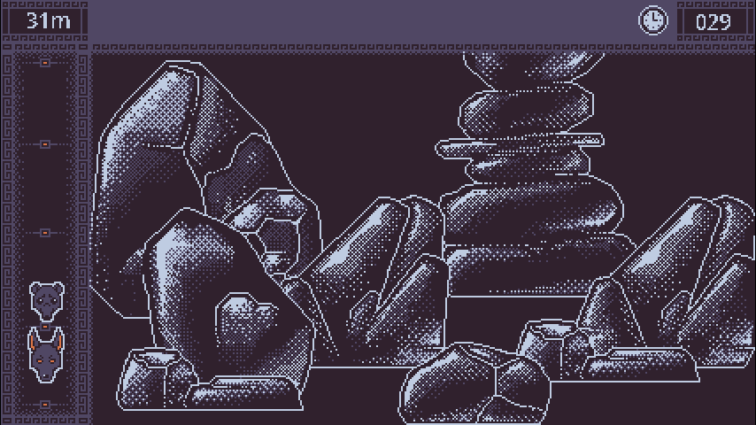
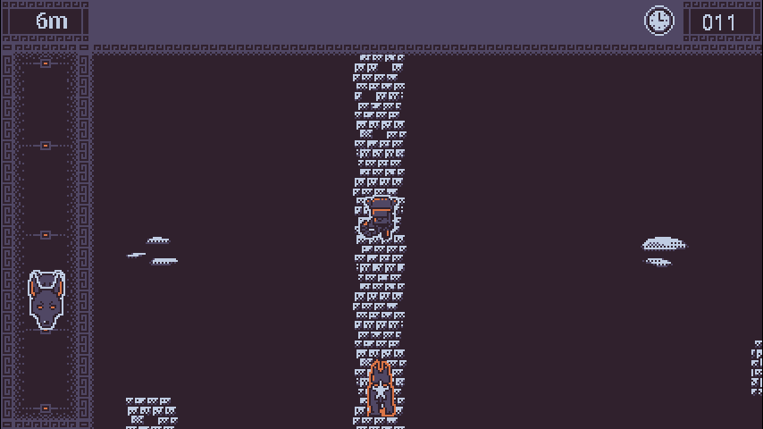
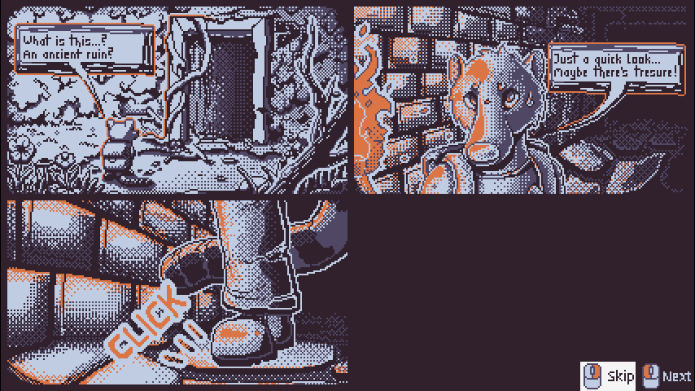
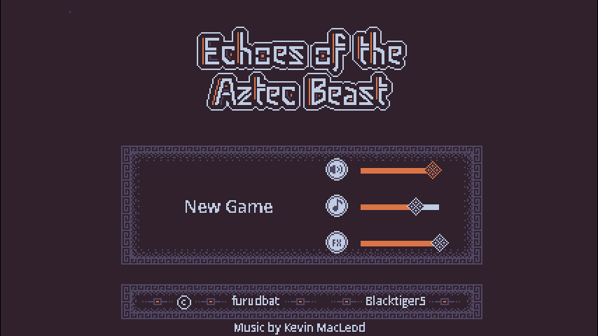

# Echoes of the Aztec Beast

Entry for [VimJam5](https://itch.io/jam/vimjam5) - Run from the Aztec Beast Ahuizotl by solving Microgames and escape the Temple

## Description

Our adventurous coati named Fee found an old ruin while exploring their local jungle. While inspecting the closer she found herself in a pickle and is now trying to escape an ancient beast. During the escape she needs to overcome many obstacles to reach the exit.

Solve Microgames like in WarioWare and escape the Beast.

## Features

- [x] Title Screen
- [ ] Music and Sound
    - [x] Settings
- [x] Intro: Comic
- [x] Map - auto run, solve obstacles to keep running
    - [x] reach Exit -> Win
- [x] Timer (Countdown) - beast gets big boost
- [x] Beast Meter - see the distance of the beast
- [x] Game Over - when beast is catched up
- [ ] Solve Microgames (obstacles)
    - [x] 3/? Microgames
        - [x] win conditions
        - [ ] ~~stun by making mistakes~~
    - [x] show Contols/Mouse promts
- [x] Language: English
- [ ] ~~pick-a-path~~
- [ ] ~~~Items: boost speed,, ...~~

### Jam

- [x] **Jam Focus**: Racing
- [x] Sub Theme: ESCAPE
- [x] 4 Color Palette
- [x] Animal Characters
- [x] Mouse Only

## How to play

You are auto-running on the main map, if you reach an obstacle, solve the Microgame.
Keep running until you reach the Exit.
Keep a good distance from the the Beast, if it catches you, it's Game Over.
Don't let the Timer run out or bad things will happen.

### Controls

Every Microgame have a little introduction at the start, <kbd>LMB</kbd> (left-click) to start the Microgame.
Most of the Microgames are solvable by clicking on something, keep an eye on special mouse and control prompts like <kbd>RMB</kbd>.

Use <kbd>LMB</kbd> to click through the prolog (Comic) or hold <kbd>RMB</kbd> to skip.

## Screenshots

## Links

- itch.io Release: https://furudbat.itch.io/echoes-of-the-aztec-beast
- https://github.com/furudbat/vimjam5

- https://github.com/bitbrain/godot-gamejam
- https://itch.io/jam/vimjam5

## Credits

 - [@furudbat](https://twitter.com/furudbat) - Programming
 - [@blacktiger5](https://bsky.app/profile/blacktiger5.bsky.social) - Art

### 3rd party assets

#### Music
    
    "Thunderhead" Kevin MacLeod (incompetech.com)
    Licensed under Creative Commons: By Attribution 4.0 License
    http://creativecommons.org/licenses/by/4.0/

    "The Complex" Kevin MacLeod (incompetech.com)
    Licensed under Creative Commons: By Attribution 4.0
    http://creativecommons.org/licenses/by/4.0/

- by Kevin MacLeod ([incompetech.com](https://incompetech.com/music/royalty-free/music.html)) - [Creative Commons: By Attribution 4.0 License](http://creativecommons.org/licenses/by/4.0/)

- Sinister Instrumental Music: [Antenalosmusic](https://freesound.org/people/Antenalosmusic/sounds/731713/) - [CC0 ; Public Domain](https://creativecommons.org/publicdomain/zero/1.0/)

#### Sound

- Monster or beast sounds: [pauliuw](https://opengameart.org/content/monster-or-beast-sounds) - [CC0 ; Public Domain](https://creativecommons.org/publicdomain/zero/1.0/)
- Animal or beast sounds: [pauliuw](https://opengameart.org/content/animal-or-beast-sounds) - [CC0 ; Public Domain](https://creativecommons.org/publicdomain/zero/1.0/)
- RPG Sound Pack: [artisticdude](https://opengameart.org/content/rpg-sound-pack) - [CC0 ; Public Domain](https://creativecommons.org/publicdomain/zero/1.0/)
- Fantozzi's Footsteps (Grass/Sand & Stone): [Fantozzi](https://opengameart.org/content/fantozzis-footsteps-grasssand-stone) - [CC0 ; Public Domain](https://creativecommons.org/publicdomain/zero/1.0/)
- Various Sound Effects: [Spring Spring](https://opengameart.org/content/various-sound-effects-0) - [CC0 ; Public Domain](https://creativecommons.org/publicdomain/zero/1.0/)
- Moving Boulder: [themightyglider](https://opengameart.org/content/moving-boulder) - [CC0 ; Public Domain](https://creativecommons.org/publicdomain/zero/1.0/)
- Fireplace Sound loop: [PagDev](https://opengameart.org/content/fireplace-sound-loop) - [CC0 ; Public Domain](https://creativecommons.org/publicdomain/zero/1.0/)
- Win Sound: [remaxim](https://opengameart.org/content/win-sound-2) - [CC-BY-SA 3.0](https://creativecommons.org/licenses/by-sa/3.0/)

### License

This project is licensed under the terms of the [MIT](LICENSE) license.

*Copyright (c) 2024 furudbat ([@furudbat](https://twitter.com/furudbat))*
