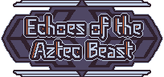

# Echoes of the Aztec Beast

Entry for [VimJam5](https://itch.io/jam/vimjam5) - Run from the Aztec Beast Ahuizotl by solving Microgames and escape the Temple

## Description

_@TODO: story_

Solve Microgames like in WarioWare and escape the Beast.

## Features

- [x] Title Screen
- [ ] Music and Sound
    - [x] Settings
- [x] Intro: Comic
- [x] Map - auto run, solve obstacles to keep running
    - [x] reach Exit -> Win
- [x] Timer (Countdown) - beast gets big boost
- [x] Beast Meter - see the distance of the beast
- [x] Game Over - when beast is catched up
- [ ] Solve Microgames (obstacles)
    - [x] 3/? Microgames
        - [x] win conditions
        - [ ] ~~stun by making mistakes~~
    - [x] show Contols/Mouse promts
- [x] Language: English
- [ ] ~~pick-a-path~~
- [ ] ~~~Items: boost speed,, ...~~

### Jam

- [x] **Jam Focus**: Racing
- [x] Sub Theme: ESCAPE
- [x] 4 Color Palette
- [x] Animal Characters
- [x] Mouse Only

## How to play

You are auto-running on the main map, if you reach an obstacl, solve the Microgame.
Keep running until you reach the Exit.
Keep a good distance from the the Beast, if it catches you, it's Game Over.
Don't let the Timer run out or bad things will happen.

### Controls

Every Microgame have a little introduction at the start, <kbd>LMB</kbd> (left-click) to start the Microgame.
Most of the Microgames are solvable by clicking on something, keep an eye on special mouse and control promts like <kbd>RMB</kbd> or <kbd>mouse wheel up/down</kbd> (for example to rotate something).

Use <kbd>LMB</kbd> to click through the Prolog (Comic) or hold <kbd>RMB</kbd> to skip.

## Screenshots

## Links

- itch.io Release: https://furudbat.itch.io/
- https://github.com/furudbat/vimjam5

- https://github.com/bitbrain/godot-gamejam
- https://itch.io/jam/vimjam5

## Credits

 - [@furudbat](https://twitter.com/furudbat) - Programming
 - [@blacktiger5](https://bsky.app/profile/blacktiger5.bsky.social) - Art

### 3rd party assets

#### Music

#### Sound

### License

This project is licensed under the terms of the [MIT](LICENSE) license.

*Copyright (c) 2024 furudbat ([@furudbat](https://twitter.com/furudbat))*
